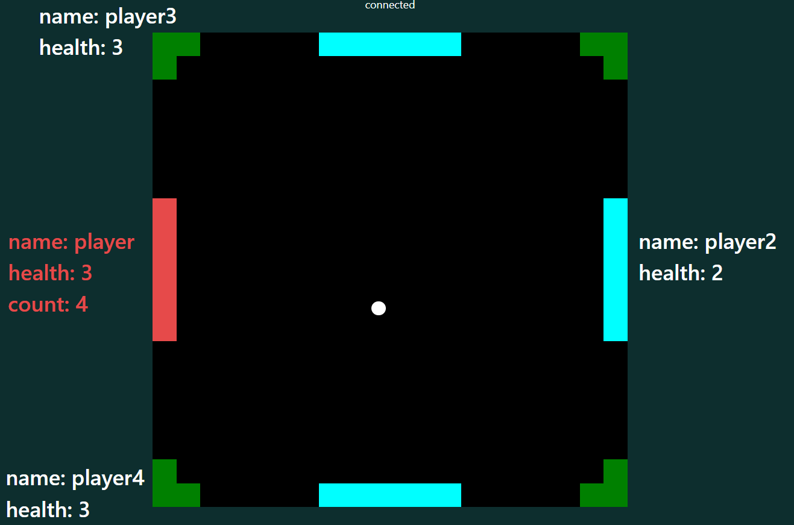
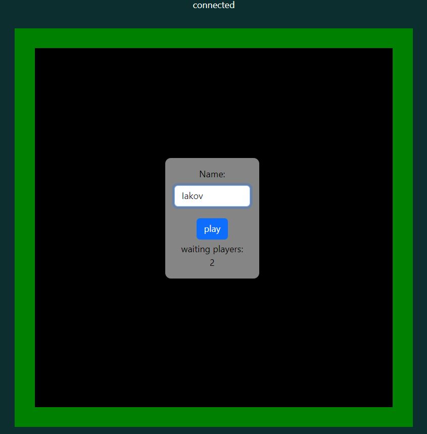
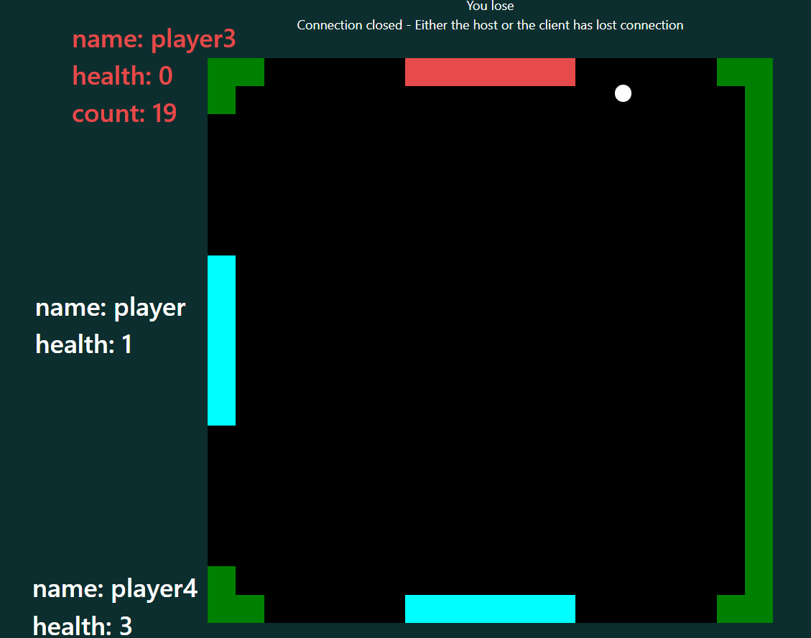

   <h1>Pong online game </h1>
    
         
Online game for 1 to 4 players with a graphical part implemented in HTML and JavaScript. The server and game mechanics are written in
         PHP. Before the game starts, each player connects to the server via web sockets. During the game, players send their coordinates to the server 
         whenever they change. The server processes the information from the players and at regular intervals sends information about the positions of the 
         sword and each player to all participants. The game also displays the score from the sword's bounces off the walls and the players' misses. If a player 
         misses 3 swords, they are eliminated from the game.
 
   <h2>Menu </h2>
  
  <h2>Lose </h2>
  
